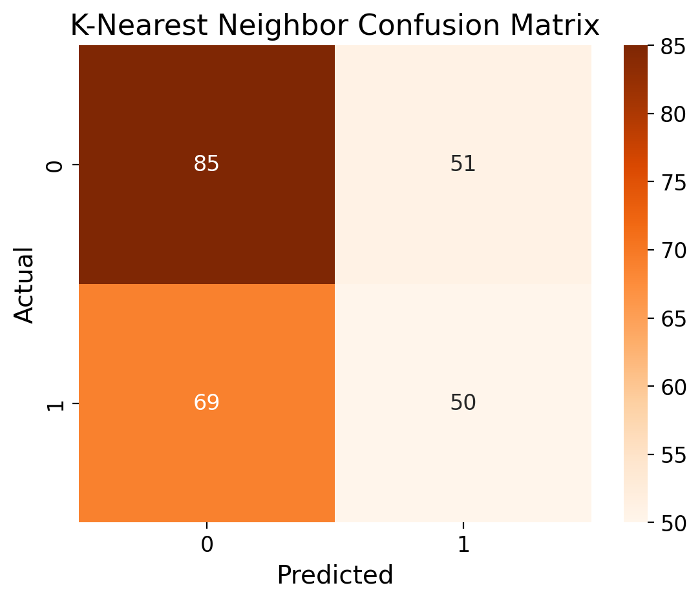
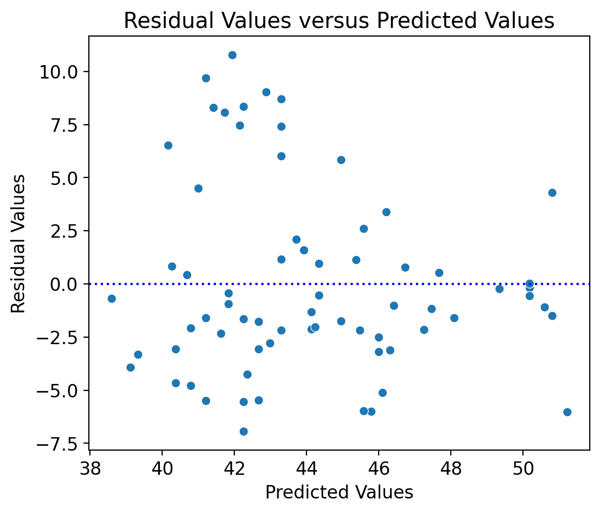

# MLStreamlitApp
## Summary ✏️
In this project, **I develop an app that helps you understand machine learning**. In the app, you can create and evaluate your own machine learning models. To personalize learning, you can upload your own datasets to train your models on. Additionally, they can also tune your models, allowing them to not just create a model but create the *best* model.

## Machine Learning Overview 🤖
Machine learning aims to replicate the human decision making process. Through mimicing how humans make decisions based on data, models can make informed predictions.

There are three types of machine learning models: **supervised**, **unsupervised**, and **reinforcement learning**. However, this app's scope is limited to supervised learning.

Supervised learning is when the model is fed a dataset that already contains labels. An example of supervised learning would be if you feed a Linear Regression model a dataset on housing options and your respective price points in order to predict the prices of other houses.

The two models in this app are **Linear Regression** and **K-Nearest Neighbor** models.

## Model Survey 🖥️

**Linear Regression** models help us understand how one or a set of variables (i.e., features) impact another variable (i.e., the target). In this app, you can select your target and feature variables. You can also decide whether you would like to scale the data or not. If you scale, everything will be in the same units!

**K-Nearest Neighbors** models work to place datapoints in the correct group (i.e., class). Like the Linear Regression model, feature and target variable selection is up to you; you also call the shots on scaling. In this app, you can also tune the model's number of neighbors (i.e., k). By adjusting this value, you change how many possible neighbors the model searches for. 
*(Rumor has it Mr. Rogers invented this one...)*

## Code Instructions 🧑‍💻
To run the code, please import the following libraries (please see the bottom of this section for specific modules to bring in):

``pandas`` for data wrangling

``seaborn`` for visualizations

``streamlit`` for interactive app development

``matplotlib`` for visualizations``

``sklearn`` for machine learning

``numpy`` for computation

  
Modules

  
  ``sklearn.model_selection``
  
  ``sklearn.preprocessing``

  ``sklearn.neighbors``

  ``sklearn.metrics``

  ``sklearn.linear_model``

  ``sklearn.model_selection``

  ``sklearn.metrics``
  
  ``matplotlib.pyplot``

*If you are having issues, please run ``!pip install`` followed by the library you are hoping to import.*

## Streamlit Instructions 📱
To access the deployed version of the app, [click here](https://hodge-data-science-portfolio-azyrfuf2jqbdjyuq2o2whg.streamlit.app/). Have fun!

To locally launch the app, please follow these steps:

1) Open your terminal

2) Check that the file *Home.py* is within your current working directory by running ``ls`` (if it isn't, use ``cd`` to navigate there)

3) Enter ``streamlit run Home.py``

4) Wait for a new browser window to open up, run the code, and start exploring!

## Sample Visualizations 🖼️

  
  

👈 The visualization on the left showcases a **confusion matrix for a K-Nearest Neighbor Model**. This is a decent model. While it can accurately identify datapoints, it cannot do it with a high level of confidence.

👉 The visualization on the right **plots a Linear Regression model's accuracy against its residuals**. The model evaluated in the example is good as the points are mostly randomly distributed, with slight clustering around when residuals equals 0.

## Sources 📚

📕 To develop a conceptual understanding, I read excerpts of [Grokking Machine Learning](https://www.manning.com/books/grokking-machine-learning) by Luis G. Serrano.

👷‍♂️ For app construction, I frequently visited Streamlit's ["Create a multipage app"](https://docs.streamlit.io/get-started/tutorials/create-a-multipage-app) page.

Images 📸

- *Business Bulldog: https://www.alamy.com/french-bulldog-dressed-as-businessman-works-at-desk-on-computer-image208809436.html*

- *Begruding Beagle: https://www.istockphoto.com/photo/dog-working-comfortably-from-home-gm170462856-22670119*

- *Preoccupied Pug: https://www.shutterstock.com/image-photo/adorable-pug-wear-red-glasses-working-755647021*

- *Mathematical Maltese: https://www.istockphoto.com/photo/dog-using-laptop-computer-gm1049887368-280769742*

- *Rattled Russell: https://www.shutterstock.com/video/clip-1104789185-jack-russell-terrier-dog-glasses-looks-hud*

- *Determined Dachshund: https://www.pinterest.com/pin/dachshund-dog-using-laptop-computer--306667055878591515/*
  

*P.S.: Curious about why there are dogs in the app? Well - this stuff can be a bit mind blowing, so I thought some dogs might soften the blow :)*
